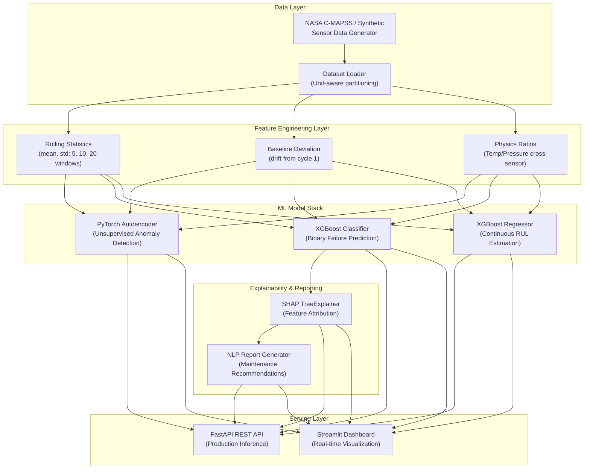

# 📋 Project Overview & System Architecture

## What Is This Project?

This is an **Industry-Grade Predictive Maintenance & Equipment Failure Intelligence System** — a complete end-to-end AI/ML platform that monitors industrial equipment (turbofan jet engines) using multi-sensor telemetry data, detects anomalies in real-time, predicts when equipment will fail, estimates how many operational cycles remain before failure, and generates actionable human-readable maintenance reports.

The system mimics what companies like **GE Aviation, Siemens, Honeywell, and Rolls-Royce** deploy in their industrial IoT (IIoT) predictive maintenance platforms — scaled down to a single-developer implementation.

---

## Problem Statement

In industrial environments, **unplanned equipment failure** costs billions annually:
- A single unplanned jet engine shutdown can cost **$500K–$2M** in downtime, repair, and lost revenue.
- Traditional maintenance strategies (run-to-failure or fixed-schedule) are either **too late** or **too expensive**.
- Modern predictive maintenance uses sensor data + ML to predict failures **before they happen**, enabling just-in-time maintenance that minimizes cost and maximizes equipment uptime.

---

## How It Works (High-Level)

```
┌──────────────────────────────────────────────────────────────────────────┐
│                    DATA FLOW ARCHITECTURE                                │
│                                                                          │
│  [21 Sensors] ──► [Feature Engineering] ──► [3 ML Models] ──► [Outputs]  │
│                                                                          │
│  Raw SCADA      Rolling Statistics        Layer 1: Autoencoder           │
│  Telemetry      Baseline Deviations       Layer 2: XGBoost Classifier    │
│  Stream         Physics Ratios            Layer 3: XGBoost Regressor     │
│                                                                          │
│                                ┌──────────────────────────┐              │
│                                │     SERVING LAYER        │              │
│                                │  ┌──────────────────┐    │              │
│                                │  │  FastAPI REST API │    │              │
│                                │  └──────────────────┘    │              │
│                                │  ┌──────────────────┐    │              │
│                                │  │ Streamlit Dashboard│   │              │
│                                │  └──────────────────┘    │              │
│                                │  ┌──────────────────┐    │              │
│                                │  │ SHAP + NLP Reports│   │              │
│                                │  └──────────────────┘    │              │
│                                └──────────────────────────┘              │
└──────────────────────────────────────────────────────────────────────────┘
```

---

## System Architecture Diagram



---

## Project Directory Structure

```
predictive-maintenance/
├── config/
│   └── config.yaml                 # Centralized hyperparameters & paths
├── data/
│   ├── raw/                        # Raw sensor telemetry files
│   └── processed/                  # Engineered feature parquet files
├── models/
│   ├── autoencoder.pth             # PyTorch Autoencoder checkpoint
│   ├── xgb_classifier.json         # XGBoost failure classifier
│   ├── xgb_classifier_meta.npz    # Feature column metadata
│   ├── xgb_regressor.json          # XGBoost RUL regressor
│   └── xgb_regressor_meta.npz    # Feature column metadata
├── src/
│   ├── data/
│   │   ├── download_data.py        # Data ingestion & synthetic generation
│   │   └── dataset_loader.py       # Loading, labeling, unit-based splitting
│   ├── features/
│   │   └── feature_engineering.py  # Rolling stats, deviations, physics ratios
│   ├── models/
│   │   ├── anomaly_detector.py     # PyTorch Autoencoder (Layer 1)
│   │   ├── failure_classifier.py   # XGBoost Classifier (Layer 2)
│   │   ├── rul_regressor.py        # XGBoost Regressor (Layer 3)
│   │   └── explainer.py           # SHAP TreeExplainer
│   ├── api/
│   │   ├── main.py                 # FastAPI REST endpoints
│   │   ├── schemas.py              # Pydantic request/response schemas
│   │   └── simulator.py           # SCADA telemetry simulator
│   ├── llm/
│   │   └── reporter.py            # NLP maintenance report generator
│   └── train.py                    # Full training pipeline orchestrator
├── dashboard/
│   └── app.py                      # Streamlit interactive operations dashboard
└── tests/                          # Unit and integration tests
```

---

## Key Design Principles

| Principle | Implementation |
|-----------|---------------|
| **Leak-Free Evaluation** | Train/test split by `unit_id` groups — no temporal data leakage |
| **Multi-Layer Defense** | 3 independent ML models providing orthogonal failure signals |
| **Physics-Informed Features** | Domain sensor ratios (thermal/pressure) capture degradation physics |
| **Explainability First** | SHAP attribution on every prediction — no black boxes |
| **Production Ready** | FastAPI REST + Streamlit UI + YAML config management |
| **Modular Architecture** | Each component is independently testable and replaceable |
