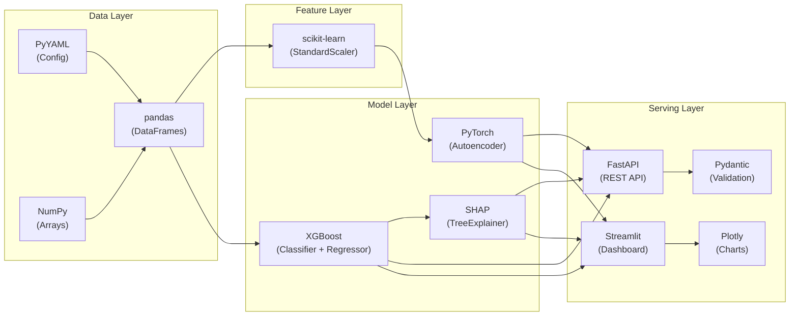

# 🛠️ Technology Stack — Complete Reference

This document lists every technology used in the project, **where** it's used, and **how** it contributes to the system.

---

## Core Technologies Summary

| Technology | Category | Version | Where Used | Contribution |
|-----------|----------|---------|------------|-------------|
| **Python** | Language | 3.14 | Entire project | Primary development language |
| **PyTorch** | Deep Learning | 2.6+ | Autoencoder | Neural network training & inference |
| **XGBoost** | Gradient Boosting | 3.4.1 | Classifier & Regressor | Supervised failure prediction + RUL |
| **scikit-learn** | ML Utilities | Latest | Preprocessing | StandardScaler, evaluation metrics |
| **SHAP** | Explainability | 0.52.0 | Explainer module | Feature attribution & root-cause analysis |
| **pandas** | Data Processing | Latest | Everywhere | DataFrames, data manipulation |
| **NumPy** | Numerical Computing | Latest | Everywhere | Array operations, statistics |
| **FastAPI** | Web Framework | Latest | REST API | Production model serving |
| **Streamlit** | Dashboard Framework | 1.63.0 | Operations Dashboard | Interactive real-time visualization |
| **Plotly** | Charting Library | Latest | Dashboard | Interactive time-series charts |
| **PyYAML** | Configuration | Latest | Config management | Centralized hyperparameter loading |
| **Pydantic** | Data Validation | Latest | API schemas | Request/response type safety |
| **Uvicorn** | ASGI Server | Latest | FastAPI server | Production HTTP serving |

---

## Detailed Technology Breakdown

### 1. PyTorch (Deep Learning Framework)

**Where used**: `src/models/anomaly_detector.py`

**How it contributes**:
- Implements the **Autoencoder neural network** for unsupervised anomaly detection
- `nn.Module` for defining the encoder-decoder architecture
- `nn.Linear`, `nn.BatchNorm1d`, `nn.ReLU` for layer definitions
- `optim.Adam` for gradient-based optimization
- `torch.utils.data.DataLoader` for mini-batch training
- `torch.save` / `torch.load` for model checkpoint serialization
- GPU-ready architecture (can move to CUDA with minimal changes)

**Specific role in the system**:
```
Raw Features (122 dims) → Encoder → Latent Space (8 dims) → Decoder → Reconstruction (122 dims)
                                                                    ↓
                                                        MSE(input vs reconstruction)
                                                                    ↓
                                                    MSE > threshold → ANOMALY
```

The autoencoder learns the manifold of "healthy" operating data. When degraded sensor patterns arrive, reconstruction error spikes → anomaly detection without any labeled failure data.

---

### 2. XGBoost (Gradient Boosted Trees)

**Where used**: `src/models/failure_classifier.py`, `src/models/rul_regressor.py`

**How it contributes**:
- **XGBClassifier**: Binary classification — "Will this equipment fail within 30 cycles?"
  - Uses `scale_pos_weight` for handling severely imbalanced failure labels
  - Outputs calibrated probability [0, 1] via `predict_proba`
  - Objective: `binary:logistic`
  
- **XGBRegressor**: Continuous regression — "How many cycles until failure?"
  - Predicts RUL (0–125 cycles) from the 122 engineered features
  - Objective: `reg:squarederror`

- **Booster API**: Used for inference to avoid segfault on Python 3.14 + Apple Silicon
  - `xgb.Booster()` + `xgb.DMatrix()` for safe model loading and prediction
  - Bypasses sklearn wrapper compatibility issues

**Why XGBoost over other algorithms**:
- Handles tabular sensor data better than deep learning
- Built-in regularization prevents overfitting on noisy sensor data
- Feature importance is native and aligns with SHAP
- Fast inference for real-time serving (<1ms per prediction)

---

### 3. SHAP (SHapley Additive exPlanations)

**Where used**: `src/models/explainer.py`

**How it contributes**:
- `shap.TreeExplainer` — optimized for tree-based models (XGBoost)
- Computes **exact Shapley values** for each feature per prediction
- Decomposes the failure probability into per-sensor contributions
- Returns signed attribution: positive SHAP → increases failure risk, negative → decreases risk

**Why it matters**:
In industrial settings, operators need to know **which physical subsystem** is degrading, not just "something is wrong." SHAP provides:
- "Sensor 3 (HPC Temperature) contributed +0.15 to failure risk"
- "Sensor 7 (HPC Pressure) contributed -0.03 (within normal range)"

This maps directly to **maintenance action items** — inspect the HPC thermal system, not the pressure system.

---

### 4. scikit-learn (ML Utilities)

**Where used**: `src/models/anomaly_detector.py`, `src/models/failure_classifier.py`, `src/models/rul_regressor.py`

**How it contributes**:
- **StandardScaler**: Z-score normalization of sensor features before autoencoder input
  - Ensures all 122 features have zero mean, unit variance
  - Prevents features with large magnitudes from dominating the loss
- **Evaluation Metrics**:
  - `roc_auc_score` — Area under ROC curve (classifier)
  - `average_precision_score` — PR-AUC (critical for imbalanced datasets)
  - `f1_score`, `precision_score`, `recall_score` — Classification quality
  - `mean_absolute_error`, `mean_squared_error`, `r2_score` — Regression quality

---

### 5. pandas (Data Processing)

**Where used**: Every module in the project

**How it contributes**:
- **DataFrame** as the universal data container across all pipeline stages
- `groupby().transform()` for unit-aware feature engineering (no cross-unit leakage)
- `rolling()` for computing temporal statistics within windows
- `read_csv()` for raw C-MAPSS data ingestion
- `to_parquet()` for efficient processed data storage
- Column selection and slicing for feature/target separation

---

### 6. NumPy (Numerical Computing)

**Where used**: Every module in the project

**How it contributes**:
- Array operations for model input/output conversion
- `np.random.seed()` for reproducible data generation and splitting
- `np.percentile()` for computing anomaly thresholds
- `np.savez()` / `np.load()` for feature column metadata persistence
- Random number generation for synthetic sensor noise

---

### 7. FastAPI (Production REST API)

**Where used**: `src/api/main.py`, `src/api/schemas.py`

**How it contributes**:
- Serves trained models as HTTP endpoints for external consumption
- `@app.on_event("startup")` loads all models into memory at boot
- `POST /predict/telemetry` — Real-time inference endpoint
- `POST /explain/recommendation` — Maintenance report generation
- CORS middleware enables cross-origin access from dashboards/frontends
- Pydantic models enforce request/response type safety and auto-generate OpenAPI docs

---

### 8. Streamlit (Interactive Dashboard)

**Where used**: `dashboard/app.py`

**How it contributes**:
- `st.set_page_config()` for wide-layout, dark-themed operations dashboard
- `st.columns()` for multi-column KPI metric cards
- `st.sidebar` for asset selection and cycle simulation controls
- `st.plotly_chart()` for interactive Plotly visualizations
- `@st.cache_resource` for model caching (load once, serve forever)
- `@st.cache_data` for dataset caching
- Custom CSS via `st.markdown(unsafe_allow_html=True)` for glassmorphism styling

---

### 9. Plotly (Interactive Charting)

**Where used**: `dashboard/app.py`

**How it contributes**:
- `plotly.graph_objects.Scatter` for multi-sensor telemetry time-series
- `plotly.express.bar` for SHAP feature attribution horizontal bar chart
- `plotly_dark` template for industrial-grade dark theme
- `add_vline()` for current cycle position marker on RUL trajectory
- Interactive hover, zoom, and pan for operations-level data exploration

---

### 10. PyYAML (Configuration)

**Where used**: `config/config.yaml`, `src/train.py`, `src/data/download_data.py`

**How it contributes**:
- Centralized configuration for all hyperparameters, file paths, and thresholds
- No hardcoded values in source code — everything loaded from YAML
- Enables easy experimentation: change `n_estimators` from 50 to 200 without touching code
- Standard industry practice for ML pipeline configuration management

---

### 11. Pydantic (Data Validation)

**Where used**: `src/api/schemas.py`

**How it contributes**:
- Defines typed request/response models for FastAPI endpoints
- `TelemetryBatchRequest` — validates incoming sensor data shape and types
- `PredictionResponse` — ensures API always returns consistent JSON structure
- `FeatureDriver` — typed SHAP attribution output
- Auto-generates interactive API documentation (Swagger UI) at `/docs`

---

## Technology Interaction Map


